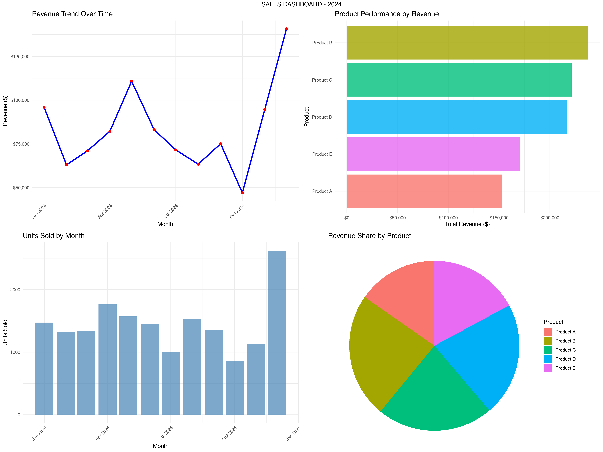

# Sales Dashboard

## Overview
A comprehensive R-based sales analytics dashboard that generates visualizations and reports for sales performance analysis. This project provides interactive data analysis tools for sales teams to track revenue trends, product performance, and monthly sales patterns.

## Features
- **Revenue Trend Analysis**: Track sales performance over time
- **Product Performance Comparison**: Analyze which products generate the most revenue
- **Monthly Sales Reports**: Monitor units sold and revenue by month
- **Product Mix Visualization**: View revenue distribution across products
- **Automated Report Generation**: Export detailed sales reports and summaries
- **Data Export**: Save analysis results in CSV format

## Files Description

### Main Script
- `dashboard_sales.R` - Main R script containing all functions for data analysis and visualization

### Generated Outputs
- 📊 `sales_dashboard.png` - Complete dashboard with 4 visualizations (Main Output Image)
- 📄 `Rplots.pdf` - Additional R plots in PDF format

### Data Files (CSV)
- 📊 `sales_raw_data.csv` - Raw sales transaction data (Generated Input Data)
- 📈 `sales_summary.csv` - Overall sales performance summary (Key Output CSV)
- 📅 `sales_by_month.csv` - Monthly sales breakdown (Time Series Output)
- 🛍️ `sales_by_product.csv` - Product-wise sales analysis (Product Performance Output)

### Reports
- `sales_report.txt` - Detailed textual sales analysis report

## Dashboard Visualization

### 📊 Generated Output: Sales Dashboard



**Output File**: `sales_dashboard.png` (High-resolution dashboard image)

The dashboard includes:
1. **Revenue Trend Over Time** - Line chart showing monthly revenue progression
2. **Product Performance by Revenue** - Bar chart ranking products by total revenue
3. **Units Sold by Month** - Column chart displaying monthly unit sales
4. **Revenue Share by Product** - Pie chart showing product revenue distribution

### 📈 Additional Visual Outputs
- `Rplots.pdf` - Additional R plots in PDF format for detailed analysis

## Sample Data Output

### Sales Summary
```csv
Total_Revenue,Total_Units,Avg_Price,Avg_Monthly_Revenue,Best_Month,Worst_Month
999103,17440,56.15,16651.7166666667,"Dec 2024","Jan 2024"
```

### Key Insights
- **Total Revenue**: $999,103
- **Total Units Sold**: 17,440 units
- **Average Price per Unit**: $56.15
- **Best Performing Month**: December 2024
- **Worst Performing Month**: January 2024

## How to Use

1. **Install Required Packages**:
   ```r
   install.packages(c("ggplot2", "dplyr", "lubridate", "gridExtra", "scales"))
   ```

2. **Load the Script**:
   ```r
   source("dashboard_sales.R")
   ```

3. **Generate Sample Data**:
   ```r
   sales_data <- generate_sales_data(n_months = 12, n_products = 5)
   ```

4. **Create Dashboard**:
   ```r
   create_sales_dashboard(sales_data)
   ```

5. **Export Reports**:
   ```r
   export_sales_report(sales_data)
   export_csv_files(sales_data)
   ```

## Functions Available

- `generate_sales_data()` - Generate sample sales data
- `sales_summary()` - Calculate overall sales statistics
- `product_analysis()` - Analyze product performance
- `monthly_analysis()` - Analyze monthly trends
- `create_sales_dashboard()` - Generate complete dashboard
- `export_sales_report()` - Export text report
- `export_csv_files()` - Export data to CSV files

## Requirements
- R (version 3.5+)
- Required packages: ggplot2, dplyr, lubridate, gridExtra, scales

## Output Files
All generated files are saved in the same directory:
- Dashboard image: `sales_dashboard.png`
- CSV files: Various sales analysis files
- Report: `sales_report.txt` 