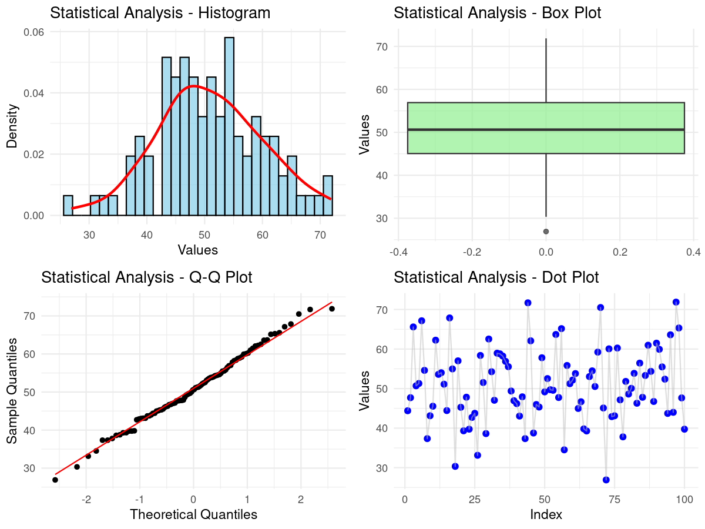

# Statistical Calculator

## Overview
A comprehensive R-based statistical analysis tool that performs descriptive statistics, normality tests, and generates visualizations for data analysis. This calculator provides detailed statistical measures and tests commonly used in data science and research.

## Features
- **Descriptive Statistics**: Calculate mean, median, mode, variance, standard deviation, and more
- **Measures of Central Tendency**: Mean, median, and mode calculations
- **Measures of Dispersion**: Variance, standard deviation, range, IQR, coefficient of variation
- **Shape Measurements**: Skewness and kurtosis analysis
- **Normality Testing**: Shapiro-Wilk, Anderson-Darling, and Kolmogorov-Smirnov tests
- **Data Visualization**: Histogram, box plot, Q-Q plot, and dot plot
- **Confidence Intervals**: Calculate confidence intervals for population parameters
- **Comprehensive Reports**: Generate detailed statistical analysis reports

## Files Description

### Main Script
- `statistic_calc.R` - Main R script containing all statistical functions and analysis tools

### Generated Outputs
- 📊 `statistical_analysis.png` - Complete statistical visualization dashboard (Main Output Image)
- 📋 `statistical_results.txt` - Detailed statistical analysis report

## Statistical Analysis Visualization

### 📊 Generated Output: Statistical Analysis Dashboard



**Output File**: `statistical_analysis.png` (Comprehensive 4-panel statistical visualization)

The visualization dashboard includes:
1. **Histogram with Density Curve** - Distribution visualization with normal curve overlay
2. **Box Plot** - Shows quartiles, outliers, and data spread
3. **Q-Q Plot** - Tests normality assumption visually
4. **Dot Plot** - Individual data point visualization

### 📋 Additional Text Outputs
- `statistical_results.txt` - Detailed statistical analysis report with all calculations

## Sample Statistical Output

### Descriptive Statistics
```
=== STATISTIK DESKRIPTIF ===

UKURAN PEMUSATAN:
Mean (Rata-rata)    : 50.9041
Median              : 50.6176
Modus               : 26.9083

UKURAN PENYEBARAN:
Variance (Varians)  : 83.3233
Std. Deviation      : 9.1282
Range               : 44.9650
IQR                 : 11.8567
Minimum             : 26.9083
Maximum             : 71.8733
Coeff. of Variation : 17.93%

KUARTIL:
Q1 (25th percentile): 45.0615
Q3 (75th percentile): 56.9182

UKURAN BENTUK:
Skewness            : 0.0605 (Symmetric)
Kurtosis            : 2.8389 (Platykurtic)

INFORMASI UMUM:
Jumlah Data (n)     : 100
Sum (Total)         : 5090.4059
```

### Normality Test Results
```
=== UJI NORMALITAS DATA ===

Alpha level: 0.050

SHAPIRO-WILK TEST:
Statistic: 0.993878
P-value  : 0.934929
Result   : Normal

ANDERSON-DARLING TEST:
Statistic: 0.181996
P-value  : 0.910379
Result   : Normal

KOLMOGOROV-SMIRNOV TEST:
Statistic: 0.058097
P-value  : 0.888438
Result   : Normal

95% Confidence Interval: [ 49.09283 , 52.71528 ]
```

## How to Use

1. **Install Required Packages**:
   ```r
   install.packages(c("ggplot2", "dplyr", "moments", "nortest", "gridExtra"))
   ```

2. **Load the Script**:
   ```r
   source("statistic_calc.R")
   ```

3. **Prepare Your Data**:
   ```r
   # Example with random normal data
   data <- rnorm(100, mean = 50, sd = 10)
   ```

4. **Calculate Descriptive Statistics**:
   ```r
   stats <- descriptive_stats(data)
   print_descriptive_stats(stats)
   ```

5. **Perform Normality Tests**:
   ```r
   norm_results <- normality_test(data)
   print_normality_test(norm_results)
   ```

6. **Create Visualizations**:
   ```r
   create_statistical_plots(data, "My Data Analysis")
   ```

7. **Calculate Confidence Intervals**:
   ```r
   conf_interval <- confidence_interval(data, confidence = 0.95)
   ```

8. **Generate Complete Analysis**:
   ```r
   complete_analysis(data, "Sample Analysis")
   ```

## Available Functions

### Descriptive Statistics
- `descriptive_stats(data)` - Calculate comprehensive descriptive statistics
- `print_descriptive_stats(stats)` - Display formatted statistical results
- `confidence_interval(data, confidence)` - Calculate confidence intervals

### Normality Testing
- `normality_test(data, alpha)` - Perform multiple normality tests
- `print_normality_test(results, alpha)` - Display test results

### Visualization
- `create_statistical_plots(data, title)` - Generate 4-panel statistical visualization
- `create_histogram(data, title)` - Create histogram with density curve
- `create_boxplot(data, title)` - Create box plot
- `create_qqplot(data, title)` - Create Q-Q plot
- `create_dotplot(data, title)` - Create dot plot

### Comprehensive Analysis
- `complete_analysis(data, title, save_file)` - Run complete statistical analysis
- `export_results(stats, norm_results, filename)` - Export results to file

## Statistical Measures Explained

### Central Tendency
- **Mean**: Average value of the dataset
- **Median**: Middle value when data is sorted
- **Mode**: Most frequently occurring value

### Dispersion
- **Variance**: Average squared deviation from mean
- **Standard Deviation**: Square root of variance
- **Range**: Difference between maximum and minimum
- **IQR**: Interquartile range (Q3 - Q1)
- **Coefficient of Variation**: Relative measure of variability

### Shape
- **Skewness**: Measure of asymmetry
  - Positive: Right-skewed (tail extends to right)
  - Negative: Left-skewed (tail extends to left)
  - Near zero: Symmetric
- **Kurtosis**: Measure of tail heaviness
  - >3: Leptokurtic (heavy tails)
  - <3: Platykurtic (light tails)
  - =3: Mesokurtic (normal)

## Requirements
- R (version 3.5+)
- Required packages: ggplot2, dplyr, moments, nortest, gridExtra

## Output Files
- Statistical plots: `statistical_analysis.png`
- Analysis report: `statistical_results.txt`
- Custom output files as specified in function calls